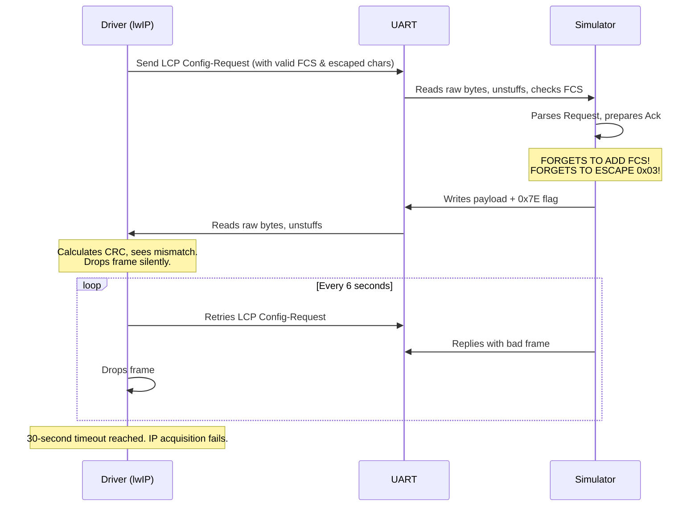
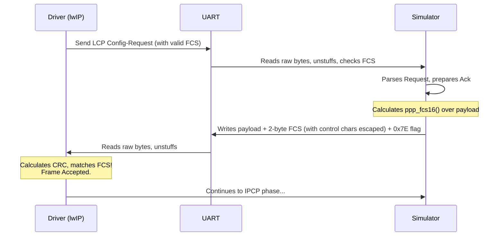
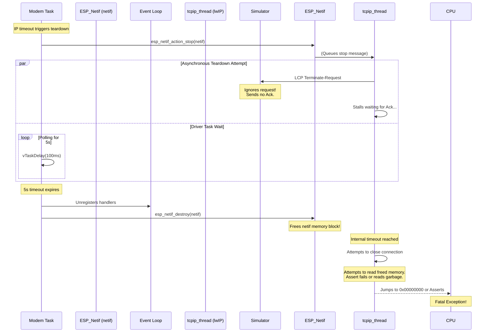
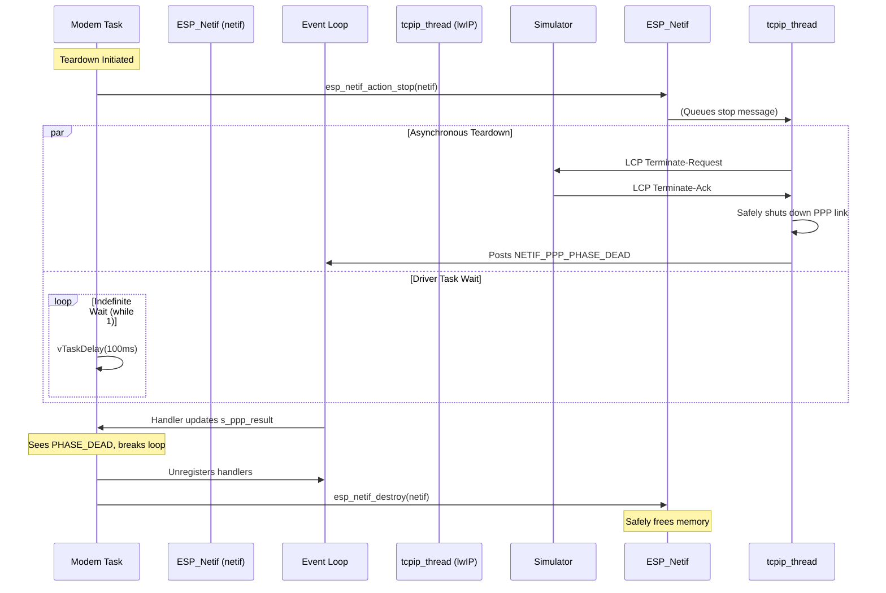

# Cellular Modem Simulator Bug Fixes

This document details several critical bugs that caused the PPP negotiation phase of the cellular modem simulator to fail, resulting in timeouts and fatal panics.

## Bug 1: Missing PPP Frame Check Sequence (FCS) & Control Character Escaping

### The Problem
A valid PPP frame transmitted over a serial link (UART) requires two things that were missing from the simulator:
1. **FCS**: A 16-bit CRC checksum appended to the end of the payload before the closing `0x7E` flag. The simulator was properly escaping bytes but completely omitted calculating the FCS.
2. **Control Character Escaping**: By default, PPP requires all control characters (`0x00` through `0x1F`) to be escaped using the Async-Control-Character-Map (ACCM). Because `0x03` is the PPP control byte, failing to escape it meant the frame was malformed.

Because the ESP-IDF `lwIP` PPP stack strictly adheres to the standard, it evaluated the incoming payload, saw an unescaped `0x03`, couldn't find a valid matching FCS at the end, and silently dropped every single frame as corrupted. This caused the driver to hit a 30-second timeout waiting for IP acquisition.

### Step-by-Step Flow: Before Fix

### How the Code Changed
In `sim_modem.c`, we added a bitwise `ppp_fcs16()` function to compute the RFC 1662 standard CRC-16. We modified `send_ppp_frame()` to calculate this checksum over the payload, and append the 2-byte result (LSB first) to the UART output stream. 
We also updated the byte stuffing logic to escape any character `< 0x20` (including `0x03`).

### Step-by-Step Flow: After Fix

---

## Bug 2: Asynchronous Teardown Use-After-Free & LCP Terminate Stall

### The Problem
When the driver failed to acquire an IP address (or disconnected intentionally), it attempted to clean up the network interface. ESP-IDF's networking stack operates asynchronously in a background FreeRTOS task called `tcpip_thread`. 

The driver code called `esp_netif_action_stop(netif)`, which queued a message to the background thread telling it to shut down the PPP control block gracefully. To do this gracefully, lwIP sends an LCP `Terminate-Request` to the modem and waits for a `Terminate-Ack`.

However, there were two critical flaws in this teardown logic that combined to cause a fatal crash:
1. **Missing Terminate-Ack**: The `sim_modem.c` did not know how to handle LCP `Terminate-Request` (code `0x05`), so it ignored the packet. Because the modem never acknowledged the termination, the `tcpip_thread` refused to close the connection and remained stuck in a retry loop.
2. **Premature Destruction**: The driver task was programmed to only wait 5 seconds for the shutdown to complete. Because `tcpip_thread` was stalled waiting for the Ack, the 5 seconds expired. The driver blindly assumed it was safe to proceed, unregistered its event handlers, and called `esp_netif_destroy(netif)` which instantly freed the network interface memory.

Seconds later, when the `tcpip_thread` finally exhausted its internal retries and gave up, it attempted to trigger the `NETIF_PPP_PHASE_DEAD` event callback. Because the driver had already freed the `netif` memory, `tcpip_thread` dereferenced a stale pointer, failing the `obj->base.netif_type == PPP_LWIP_NETIF` assertion and causing a panic on Core 0.

### Step-by-Step Flow: Before Fix

### How the Code Changed
1. **In `sim_modem.c`**: We added support for handling LCP `Terminate-Request` frames. Previously, the simulator's LCP handler `handle_lcp_frame` only recognized `Config-Request` (code `0x01`). Because the teardown sequence relies on LCP code `0x05`, the simulator was silently dropping the shutdown command. We added an `else if (lcp_code == 0x05)` block that immediately replies with an LCP `Terminate-Ack` (code `0x06`). This allows the `tcpip_thread` to gracefully close the connection in milliseconds rather than stalling and waiting for a timeout.
2. **In `modem_driver.c`**: We removed the fragile 5-second timeout in `teardown_ppp_netif`. Now that the simulator reliably answers the termination request, we changed the polling loop into an infinite `while (1)` loop. The driver will safely and indefinitely block until `s_ppp_result` is updated by the event handler (indicating lwIP has fully safely finished its teardown) before calling `esp_netif_destroy()`.

### Step-by-Step Flow: After Fix

---

## Bug 3: IPCP Config-Reject & Infinite IP Timeout

### The Problem
Despite successful initial AT commands and PPP data mode entry, the network connection was constantly timing out after 30 seconds (`PPP IP timeout (30s)`). 

During the IP Control Protocol (IPCP) negotiation, the simulator (`sim_modem.c`) was generating an IPCP `Config-Request` that included its own IP address AND proposed primary and secondary DNS server addresses. 

In the PPP specification, a dial-up client (the ESP32) can ask the server (the modem) for DNS addresses, but the server should not proactively push DNS server configurations to the client via its own request. When the ESP-IDF `lwIP` stack received the modem's request containing DNS options, it strictly adhered to the RFC and replied with an IPCP `Config-Reject` (code `0x04`).

Because `sim_modem.c` did not have logic to gracefully handle a `Config-Reject` and strip out the rejected options, it simply dropped the packet. As a result, the IPCP handshake was never formally completed, the network interface was never brought "UP", and the `IP_EVENT_PPP_GOT_IP` event never fired. The driver blindly waited in a loop for 30 seconds before giving up and tearing down the link.

### How the Code Changed
In `sim_modem.c` inside `handle_ipcp_frame`, we fundamentally changed the simulator's IPCP logic. 

Previously, the simulator was behaving like a client, proposing all its desired settings (`modem_ip` and `dns_ip`) to lwIP at once. But in PPP, the modem acts as the server. When the ESP32 (client) connects, the modem is only supposed to declare its own routing address, not push DNS servers onto the client unprompted. 

We modified the IPCP `Config-Request` payload generated by the modem to only propose its own IP address (`SIM_MODEM_IP`). We shortened the length from 22 bytes to 10 bytes, entirely stripping out the `0x81` (Primary DNS) and `0x83` (Secondary DNS) options.

With the offending DNS options removed, `lwIP` now accepts the configuration and immediately replies with a `Config-Ack` (`0x02`), allowing IPCP negotiation to complete instantly. This triggers the `IP_EVENT_PPP_GOT_IP` event, breaking the driver's 30-second wait loop and transitioning the link directly to the active state.