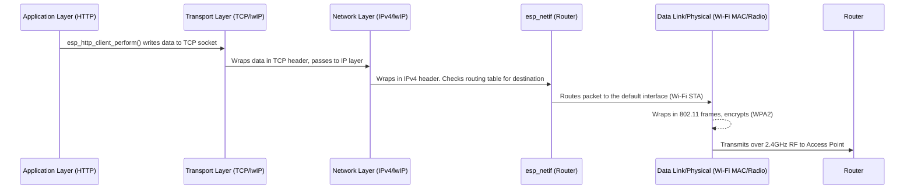

# Wi-Fi and Network Application Flow

This document details the step-by-step initialization and operation of the Wi-Fi driver and the hardware-agnostic Network Application layer. It correlates the initialization code with the standard OSI/TCP-IP networking layers.

## 1. Network Stack & Event Loop Initialization
Before any hardware drivers can be loaded, the underlying OS mechanisms must be prepared.

**File:** `main.c`
*   `esp_netif_init()`: Initializes the underlying lwIP (Lightweight IP) TCP/IP stack (Layer 3 & 4).
*   `esp_event_loop_create_default()`: Creates the system-wide event loop for routing Wi-Fi and IP events across tasks.

---

## 2. Wi-Fi Driver Initialization (`wifi_driver.c`)

The `wifi_driver` handles the physical connection to the Access Point (AP). This operates primarily at **Layer 1 (Physical)** and **Layer 2 (Data Link)**.

*   **Step 1: Initialize NVS (Non-Volatile Storage)**
    *   The Wi-Fi driver requires NVS to store RF calibration data and network credentials.
*   **Step 2: Create the default Wi-Fi Station network interface**
    *   `esp_netif_create_default_wifi_sta()` links the Wi-Fi hardware driver to the lwIP TCP/IP stack.
*   **Step 3: Initialize the Wi-Fi driver with default configurations**
    *   Allocates resources for the Wi-Fi driver and starts the internal Wi-Fi RTOS task (`esp_wifi_init`).
*   **Step 4: Register event handlers for Wi-Fi and IP events**
    *   Listens for `WIFI_EVENT` (like starting or disconnecting) and `IP_EVENT` (acquiring an IP address).
*   **Step 5: Configure Wi-Fi connection parameters**
    *   Sets the SSID, password, and security authentication mode (WPA2).
*   **Step 6: Start the Wi-Fi driver in Station mode**
    *   `esp_wifi_start()` turns on the radio. This triggers the `WIFI_EVENT_STA_START` event.
*   **Event Handler Execution:**
    *   Caught `WIFI_EVENT_STA_START` -> Calls `esp_wifi_connect()`.
    *   The ESP32 negotiates with the router (Layer 2) and runs DHCP (Layer 3) to get an IP address.
    *   Once DHCP completes, the lwIP stack fires `IP_EVENT_STA_GOT_IP`.

---

## 3. Network Application Initialization (`network_app.c`)

The `network_app` operates at **Layer 7 (Application)**. It is completely unaware of *how* the ESP32 connected (Wi-Fi vs Cellular). It only cares about IP layer availability.

*   **Step 0a: Register event handler for any IP event**
    *   Registers `on_ip_event` to listen for *any* IP acquisition (`IP_EVENT_STA_GOT_IP` or `IP_EVENT_PPP_GOT_IP`).
*   **Step 0b: Configure SNTP**
    *   Sets up the Network Time Protocol client. Even though there is no IP address yet, it tells the system: *"Once an IP is available, automatically start querying `pool.ntp.org` in the background."*

---

## 4. Main Application Task Execution (`network_app_task`)

Launched as a separate FreeRTOS task, this handles the actual business logic of the device once it powers on.

*   **Step 1: Wait for the network link to be established**
    *   `network_app_wait_for_connection()`: Blocks execution until the event loop sets the `IP_READY_BIT` (which happened during Wi-Fi Event Handler Execution).
*   **Step 2: Wait for SNTP to sync the time**
    *   `network_app_wait_for_time_sync()`: Blocks until the background SNTP client successfully receives an NTP UDP response and fires its callback setting the `TIME_SYNC_BIT`.
*   **Step 3: Test direct internet connectivity (HTTP GET)**
    *   **Step 3a:** Ensure we have an IP (safety check).
    *   **Step 3b:** Configure the HTTP Client (`esp_http_client_init`). We tell it to fetch `http://httpbin.org/get`.
    *   **Step 3c:** Execute the request (`esp_http_client_perform`). Data streams in through `_http_event_handler`.

---

## 5. Regular Data Transmission Flow (Steady State)

Once all initialization steps are finished and the IP address is held, regular Application Layer transmissions (like HTTP, MQTT, WebSockets) follow this flow entirely automatically through the ESP-IDF/lwIP stack:

**Key Takeaway:** 
The application (`network_app`) just opens a standard POSIX socket and writes data. The `esp_netif` routing table automatically looks at the default interface (configured during `wifi_driver_init`) and funnels the bytes out through the Wi-Fi driver, converting the high-level request into physical radio waves transparently.